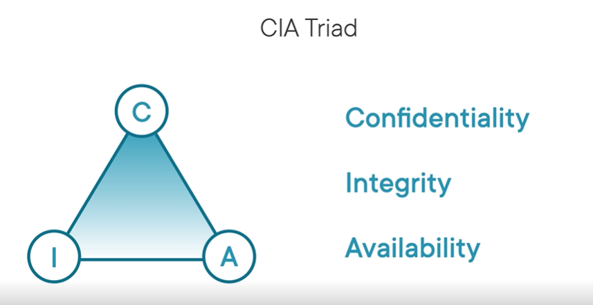
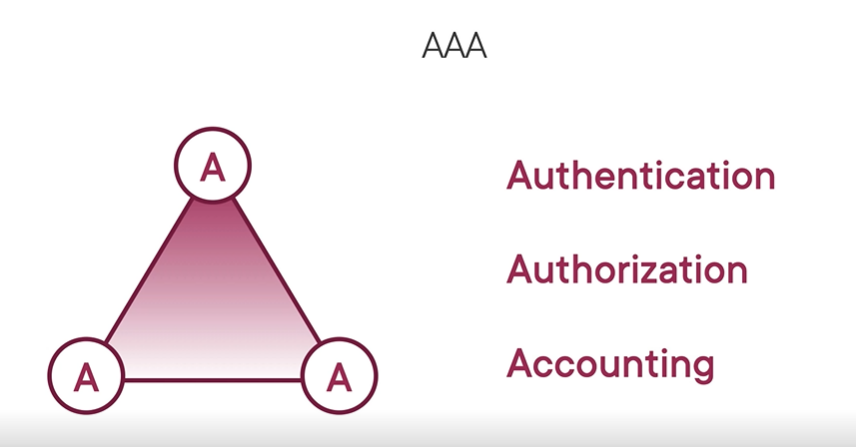
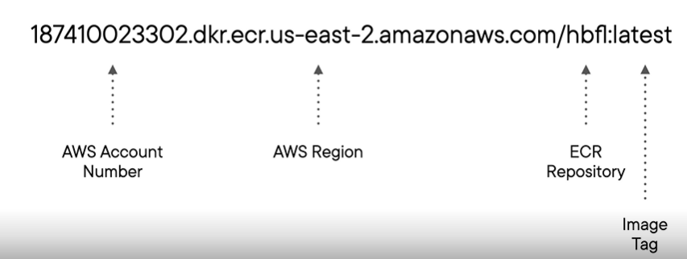

# AWS Deployment and Security

## Deploying and Securing on AWS

### Deployment Stragies 

There are many options for deploying code to AWS. This covers a few strategies.

1. Cloud Formation - Create a template that configures resources
2. Elastic Beanstalk - Works best with running only one application and uses CloudFormation under the hood
3. Elastic Container Service - Makes it easy to run docker containers and kubernetes in the cloud.

### What Does Security in AWS Mean?

What its not: Does not handle making your code secure
What it is: Securing access to/from your resources, patching software/OS/Engine vulnerabilities, configuring permissions

### Shared Security Model

Defines what AWS and the developer are responsible for. Essentially defines a contract.

AWS agrees to:
1. Maintain physical facilities
2. Maintain security at those facilities
3. Maintain the network infrastructure
4. Enable secure connections to the server

Types of services
AWS divides their services into three groups

1. Infrastructure Services - EC2, VPC, and EBS. For these services, the developer is responsible for more of the security
    - Developer has the most control over security (Software, Data, and Credentials)
    - AWS handles basic security responsibilties and updated AMIs
2. Container Services - RDS, Elastic Beanstalk. For these, there's an equal shared responsibility
    - AWS handles the basic security responsibilities, OS/software updates
    - Devleoper is responsible for securing access
3. Abstracted Services - DynamoDB, SQS. For these, AWS handles almost all of the security
    - AWS basically handles everything include server-side data encrpytion
    - Developer manages IAM roles

### Essential Security Concepts

CIA Triad - the Developer's Responsibility

1. Confidentiality - ensuring that those that those that need access, do, and those that do not, don't.
2. Integrity - keeping data safe from undesired modification and deletion. AKA Least Permission Principle and keeping backups
3. Availability - ensuring data is available to authorized users when they need it.

AAA Triad

1. Authentication - determining if the user is who they say they are through username/password or JWT
2. Authorization - determining if the user can do what they want to
3. Accounting - logs records of what users are doing through CloudTrail

## Application Deployment

### Cloud Formation

Interesting Tid bits about CloudFormation
- When it is executed, it uses the permissions of the current user
- It can create up to 100 resources in the same template
- It is IaC and it can reference other CloudFormation templates
- If one resource fails to be created, all fail and it rolls back
- The latest AWS CloudFormation template version is Sept 9, 2010 😮
- CloudFormation cannot create key pairs!

The command to run is `aws cloudformation deploy`.
The example used a template file to create several resources, configure parameters, and output the load balancer url to direct to the app.
To update the stack, run the same command but probably change some input parmaters.s
If you want to see what's going to change before you execute the update, tell `aws cloudformation` to display the change set. Then after reviewing it, you can execute the changeset.
After you're done, you can delete the entire stack!

### Elastic Beanstalk

There is a specific CLI for Elastic Beanstalk

AWS has several services to help with CI/CD:

1. CodeCommit - Source Control Repository
2. CodeBuild - Build and Test Code
3. CodeDeploy - Deploy to AWS Services
4. CodePipeline - Pulls all the CI/CD services together

There's a CodePipeline Course Available by Ryan Lewis on PluralSight

### Elastic Container Registry (ECR)

Handles choosing the container image 

#### Benefits

1. Check it into your source control so you also have environment configurations
2. You can share your container images
3. When auto-scaling or switching builds from QA -> Prod, having it containerized ensures consistency across environments

#### Registries

There are public and private registries and each registry has a repository. An image belongs to a repository

_Note_: The URIs contain your account number, so they will already be unique

### Elastic Container Service (ECS)

**Containerization**: Provide isolated environments for apps to run. Typically, many conatiainers run on the same computing env.
**Cluster**: A collection of container instances
**Task Definition**: Defines all the properties of running a task.
**Task**: Runs the container and defines the configuration options for the container

_Note_: Fargate makes it much easier to run containers in ECS

I GOT BORED OF THIS COURSE AND DIDN'T FINISH IT - COME BACK HERE