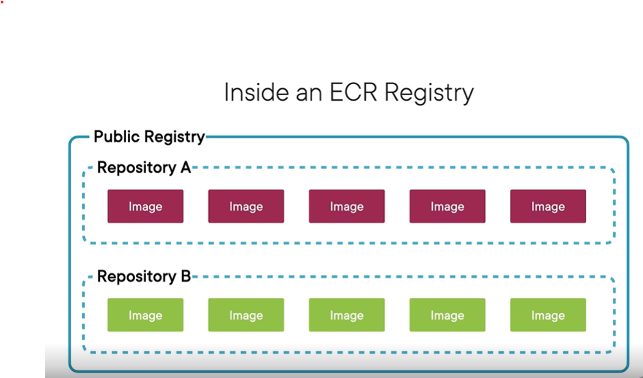

# AWS Deployment and Security

## Deploying and Securing on AWS

### Deployment Stragies 

There are many options for deploying code to AWS. This covers a few strategies.

1. Cloud Formation - Create a template that configures resources
2. Elastic Beanstalk - Works best with running only one application and uses CloudFormation under the hood
3. Elastic Container Service - Makes it easy to run docker containers and kubernetes in the cloud.

### What Does Security in AWS Mean?

What its not: Does not handle making your code secure
What it is: Securing access to/from your resources, patching software/OS/Engine vulnerabilities, configuring permissions

### Shared Security Model

Defines what AWS and the developer are responsible for. Essentially defines a contract.

AWS agrees to:
1. Maintain physical facilities
2. Maintain security at those facilities
3. Maintain the network infrastructure
4. Enable secure connections to the server

Types of services
AWS divides their services into three groups

1. Infrastructure Services - EC2, VPC, and EBS. For these services, the developer is responsible for more of the security
    - Developer has the most control over security (Software, Data, and Credentials)
    - AWS handles basic security responsibilties and updated AMIs
2. Container Services - RDS, Elastic Beanstalk. For these, there's an equal shared responsibility
    - AWS handles the basic security responsibilities, OS/software updates
    - Devleoper is responsible for securing access
3. Abstracted Services - DynamoDB, SQS. For these, AWS handles almost all of the security
    - AWS basically handles everything include server-side data encrpytion
    - Developer manages IAM roles

### Essential Security Concepts

CIA Triad - the Developer's Responsibility

1. Confidentiality - ensuring that those that those that need access, do, and those that do not, don't.
2. Integrity - keeping data safe from undesired modification and deletion. AKA Least Permission Principle and keeping backups
3. Availability - ensuring data is available to authorized users when they need it.

AAA Triad

1. Authentication - determining if the user is who they say they are through username/password or JWT
2. Authorization - determining if the user can do what they want to
3. Accounting - logs records of what users are doing through CloudTrail

## Application Deployment

### Cloud Formation

Interesting Tid bits about CloudFormation
- When it is executed, it uses the permissions of the current user
- It can create up to 100 resources in the same template
- It is IaC and it can reference other CloudFormation templates
- If one resource fails to be created, all fail and it rolls back
- The latest AWS CloudFormation template version is Sept 9, 2010 😮
- CloudFormation cannot create key pairs!

The command to run is `aws cloudformation deploy`.
The example used a template file to create several resources, configure parameters, and output the load balancer url to direct to the app.
To update the stack, run the same command but probably change some input parmaters.s
If you want to see what's going to change before you execute the update, tell `aws cloudformation` to display the change set. Then after reviewing it, you can execute the changeset.
After you're done, you can delete the entire stack!

### Elastic Beanstalk

There is a specific CLI for Elastic Beanstalk

AWS has several services to help with CI/CD:

1. CodeCommit - Source Control Repository
2. CodeBuild - Build and Test Code
3. CodeDeploy - Deploy to AWS Services
4. CodePipeline - Pulls all the CI/CD services together

There's a CodePipeline Course Available by Ryan Lewis on PluralSight

### Elastic Container Registry (ECR)

Handles choosing the container image 

#### Benefits

1. Check it into your source control so you also have environment configurations
2. You can share your container images
3. When auto-scaling or switching builds from QA -> Prod, having it containerized ensures consistency across environments

#### Registries

There are public and private registries and each registry has a repository. An image belongs to a repository

_Note_: The URIs contain your account number, so they will already be unique

### Elastic Container Service (ECS)

**Containerization**: Provide isolated environments for apps to run. Typically, many conatiainers run on the same computing env.
**Cluster**: A collection of container instances
**Task Definition**: Defines all the properties of running a task.
**Task**: Runs the container and defines the configuration options for the container

_Note_: Fargate makes it much easier to run containers in ECS

## Coordinating Services with Simple Workflow in AWS

### Understanding Simple Workflow

Simple Workflow acts as an intermediary coordinator to disparate services and applications. It exposes an interface to connect to.

** The videos are horrible for this section - so watch a different tutorial

## Securing Infrastructure in AWS

### The Power of VPC

If you end up skipping one of these layers, you could be out of a job

VPCs are ubiquitous across enterprices

**Hybrid Cloud**: Architecture design where a cloud and on-premises resources interact over a VPN connection. This makes sure connections never go over the internet

This example shows an EC2 instance in AWs connecting to an on-prem DB over a VPN connection

There are advantages to using a VPN instead of connecting over the internet for AWS vs on-prem resources
    1. Faster connection speeds (because there won't be intermediary hops)
    2. No API Layer to build
    3. More secure behind the company firewall

**VPC Peering**: Sets up up a connection between two VPCs and allows resources to talk to each other using their _private_ IP addresses.

_NOTE_: You can even do this across different AWS accounts

This shows VPC peering within one account

This shows VPC peering across accounts

### Ingress/Egress Filtering

**Ingress**: Incoming Traffic
**Egress**: Outgoing Traffic

**Network Access Control List**: Filters traffic between subnets by IP Address and port. It's like a big security group for a subnet.

- A VPC has a Network ACL which the subnet inherits but a subnet can have additional ones that the VPC doesn't. 

- Network ACL rules trump security group rules

- Network ACL **ONLY** filters traffic going into a subnet (that's why it takes precedence because it comes first). Once the traffic is already in the subnet, the Network ACL no longer applies. But, traffic between different subnets does go through the Network ACL

- They are completely stateless, every packet is checked

- Each rule in a Network ACL has a 'Rule Number' which chronologically ranks each rule

- Egress rules are great for preventing a hacker that got in from sending a lot of info out to unauthorized ip addresses

### Configuring a VPC

**Ephemeral Ports**: Ports on clients used to connect to servers
    - Example: Port 1786 on the client to connect to port 80 on the server
    - For web apps, clients have Ports 1024-65535 whitelisted as ephemeral ports

### Using VPC Flow Logs

**VPC Flow Logs**: Logs packets coming through VPC Subnets. Aggregates packets according to a capture window.

### Using CloudTrail

CloudTrail records API activity in the user's AWS account.

CloudWatch vs CloudTrail: CloudWatch monitors services and applications whereas CloudTrail is used to monitor configuration changes for compliance

- Monitor management and data events
- Can be configured to export logs to an S3 bucket
- These can be consumed by a log analysis tool (like Splunk)

### Encrypting Data at Rest in AWS

To encrypt data in transit, use HTTPS to encrypt with SSL or encrypt data before transit.

When encrpyting data, it uses the encrpytion keys in the AWS Key Management Service (KMS). You can encrypt data with different keys, making it more secure.

Each KMS Customer Managed Key is $1 / month
Encrypt/Decrypt Request: $0.03/10,000 calls (first 20k requests are free)

_Note_: With databases (RDS and DynamoDB), this is fairly cheap because they will store the key in memory but S3 DOES NOT AND CAN COST YOU SOME MONEY

## Managing Access to AWS

### The IAM Security Model

**IAM Authentication**: Determines if a user is who they say they are

Multiple methods to authenticate:
    1. Password: This is actually optional and is only required to login into the console
        - Password Complexity, Length, and Expiration are configurable
        - Enable MFA
    2. Access Keys: This enables access through the CLI or SDK
        - Consists of a Key that is shareable and a private key that is only visible on creation
        - These should be rotated periodically

**IAM Authorization**: Determines what hte user can and can't do
**Policy**: A rule that either allows or denies an action on a resource
    - They can be super broad or very specific
    - Always follow the policy of least privilege
    - NOTE: There are already _hundreds_ of defined policies in AWS but you can create custom ones that contain other policies
    - NOTE: There are (+) signs next to policies that are a group of other policies and orange AWS boxes next to individual policies

### Users, Groups, and Roles
**IAM User**: Person or service that needs access to AWS
    - Policies can be attached to a user but this is NOT a best practice
    - Best practice is to attach policies to groups
    - Ryan suggests that this can be overkill for small orgs. His recommendation is for:
        - 1-5  Users: Attach policies to users
        - 6-20 Users: Assign users to groups
        - 20+  Users: Use SAML or OpenID

**IAM Group**: Contains users and policies to cleanly assign permissions to users.
    - There's a Many-to-Many relationship between users and groups

**IAM Role**: Entities that have attached policies. Resources can assume a role to obtain the permissions from the policies.
    - They don't have a traditional relationship with authentication methods

### Cognito

IAM is for developers and internal teams to manage access within AWS.
But what about your actual end users that need to authenticate to your application? Use Cognito!

This handles user authentication, authorization, and user management.

Authentication has built-in support for username/password, 3rd-parties like Amazon, Google, and Facebook, and MFA.

User authorization defines policies for resources/service management for each user as they sign up.

User Management lets new users sign up, reset passwords, and even can help you search users on the backend.
