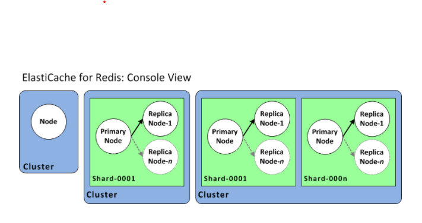
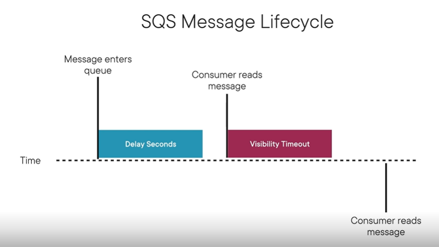
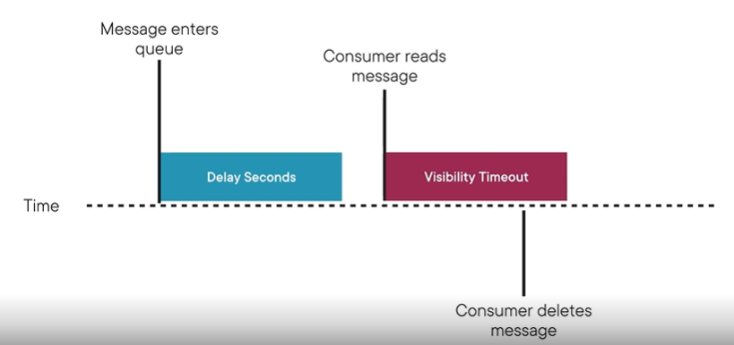
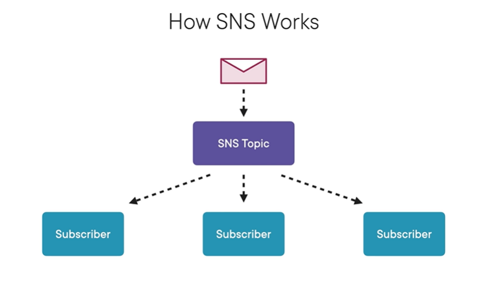

## Designing and Developing

### Domains

Services are grouped together into domains such as

- Storage
- Compute
- Database
- Network and Content Delivery
- Developer Tools
- Management and Governance
- Security, Identity, and Compliance
- Analytics
- Application Integration

### SDKs

AWS has Server Side SDKs for Java, .NET, C++, Python, Ruby, Go, and Node
Plus Client Side SDKs for JavaScript
Mobile SDKs for Android, Unity, iOS, and Xamarin

The SDKs are super helpful because they sign each request for you. Doing it manually is a pain in the butt

### Setting up an AWS Account

After you setup an account, SETUP A BUDGETING ALARM
This let's you set a maximum you want to be charged each month and trigger alerts if you hit a threshold

## Launching Instances in AWS

EC2 instances can allow you indepedently change the storage from the OS.
File Systems include
- Instance Store: Physically connected, basic hard drives
- Elastic Block Store: Independent, networked volume
- Elastic File System: Scalable, independent, networked volume

Instance volumes can't be stopped - only terminated or restarted.
EBS can be stopped and will persist their data, and have a really fast boot time

You can create your own AMI and select who else can use it:
- Public: Anyone can use it
- Explicit: Specify who can use it
- Implicit: Private to you

**AMIs ARE REGION SPECIFIC**

### EC2 Instance Classes

**On-Demand**: Pay for what you use, no commitment, easy to create/delete, good for apps that scale. Good for learning

**Reserved Instances**: Commitment for a period of time (1-3 years), huge discounts, good for large companies

**Spot Instances**: Bid for computing resources because they are spares. Huge discounts (up to 90% off). Good for flexible computing jobs like research or data analytics but not apps

There are limits for how many EC2s you can have running in a region.
You can always ask AWS to increase those limits which would be useful for corporate accounts.

## Scalable Computing in AWS

### Scalability vs Elasticity

**Scalability**: Increasing or decreasing the size or quantity of an AWS resource. Most are scalable by default

**Elasticity**: Scaling in response to preset rules, often triggered by ClouthWatch alarms.

Scalability increases/decreases the size of the resource but elasticity can create more instances of a resource to meet a sudden demand.

Scalability is required for elasticity but not vice-versa.

### Auto Scaling

Auto Scaling Policies determine when a auto scaling group should execute. There are two options for this:
1. Simple Scaling Policy - The OG policy that monitors attributes and then triggers actions. There can only be one action per alarm so they had to have two alarms (one for scaling up and one for scaling down).

2. Step Scaling Policy - Allows for multiple alarms to be defined per policy

3. Target Tracking Scaling Policy - Define a metric target and auto scaling tries to keep it at that metric. This is the recommend policy by AWS. 

## Storage in AWS

### EBS vs EFS vs Instance Storage

**Instance Storage**: Initial EC2 storage option that AWS released. They are physically connected hard drives, completely wipe if the EC2 instance is terminated or stopped, can't be moved to a different source easily, and you can't create a snapshot of it without manual work.

**Elastic Block Store Volumes**: These are indepdent of the EC2 instance, can detach and be reused, can be backed up with a snapshot, and doesn't lose data if the EC2 instance is stopped. They are also replicated across availability zones. This is the go-to for a normal use case.

**Elastic File Storage**: Created to be a storage source for several EC2 isntances and is used to solve big data storage issues.

### S3

S3 comes with versioning! Only downside is cost - previous versions are charged teh same price as the current version.

Lifecycle Events - determine what to do with an object after a certain # of days have passed. For instance, after 5 days change the access type to _Infrequent_ or move it to Glacier storage. This can only be triggered for previous versions. You can also trigger a deletion after a certain # of days!

Bucket names need to be globally unique and can't have underscores.

### Limits

1. The EC2 instance MUST BE STOPPED if you are moving a root volume
2. EBS volumes can only attach to EC2 instances in the same availability zone
3. S3 has a limit of 100 buckets per account
4. S3 bucket names must be globally unique

## Persistence in AWS

The two main persistance servies are DynamoDB and RDS

### DynamoDB

#### Throughput Capacity

Defined as the # of records that can be read or written per second.
4kb for reading and 1kb for writing.

Example for Writing Records:
If there are six records you are going to write, each 100kb, they will be rounded up to 1kb each. That will consume 6 units.

**Burst Capacity** - used when throughput capacity is exceeded. No guarantees are given from AWS of this availability so assume it won't work. The SDKs already handle the exceptions thrown when you run out of units so it has built-in retries.

Example for Reading Records:
If you then read those six records, each 100kb, they will be rounded up to 1kb each. That will consume 6 units. Caveat - unless they are **eventually consistent**.

- **Eventually Consistent** - A cached version of the record that is eventually synced. So, it's not guaranteed to be fresh but it allows you to have 2x as many units for reading. This is the default behavior.

- **Strongly Consistent** - Actually hits the record, so its guaranteed to be correct.

Another example:
How many units would it take to read a 20kb file?

Answer:

- Eventually Consistent Read: You get 8kb / unit, so 20 / 8 = 2.5 units and rounded up would be 3 units.
- Strongly Consistent Read: You get 4kb / unit (like normal), so 20 / 4 = 5 units.
- Writing: You get no discount for writing, so 20 / 1 = 20 units.

#### Capacity Modes

**Provisioned Capacity Mode** - Set read and write throughput capacity that you are charged for whether you use it or not. Has the capability to autoscaling. Uses burst capacity (if available) if you go over your provisioned read/write capacity units.

**On-demand Capacity Mode** - Charged for each read/write request which is scaled according to demand. This is more expensive per read/write but you aren't charged when you're not using it. Could be less expensive if only used in peak times or more expensive if it is consistently used.

#### Parition and Secondary Keys

**Partition Key** - A primary index that identifies a record or set of records.

**Sort Key** - Determines the order of the records that are in the same partition.

**Local Secondary Index** - Another optional sort key that is used with the original partition key. This does not interact with the other sort key. Note that this has nothing to do with the Global Secondary Index.

For example, if you have a logging system for several apps, the partition key could be the app name and the sort key could be the created_at date. 

These keys should be baesd on the most used/important access pattern. If you need more access patterns, use Global Secondary indexes.

#### Global Secondary Indexes

Duplicates the original records and uses a new partition key to help you query the data faster. This costs extra money because you have to setup new provisioned capacity units.

#### DynamoDB Limits

1. Can only have 5 global and local secondary indexes per table.
2. Local secondary indexes must be created when the table is created.
3. Global Secondary indexes can be created whenever.

### RDS

A relational database that takes care of the backups and maintenance. 

#### RDS Limits

1. Soft limits on number and size of the database, although it's probably in the terabytes.

### ElastiCache

A layer in between EC2 and the database that caches requests and data. It's an in-memory service that never actually connects to the database. 

The app would need to check the cache first and if that returned a miss, then it would query the DB and write it to the cache to make the next read faster. There are plenty of SDKs to help with this.

Redis is the industry standard for ElastiCache.

### Cluster vs Node

- A cluster is a node if there is a 1:1 relationship as in the first image. 
- If Cluster-mode is off, then a node is replicated within the same cluster which allows for backups in case the original node goes down.
- If Cluster-mode is onn, then a collection of nodes are replicated across availability zones. There can be up to 90 copies (or 500 if specially requested).

#### ElastiCache Limts

1. Soft limits on the number of clusters and nodes
    - Limit of 90 if cluster-mode is enabled but can request up to 500!
2. Cluster's can't be accessed outside of VPC

## Routing

### Route53

Configures simple DNS rules but has some awesome features:

- **Simple** - Maps a single DNS record to a single AWS Resource
- **Weighted** - Configures multiple resources to a single record but has weights assigned to each resource. For example, one resource can have a weight of 2 and the other 1, so 2/3rds would go to one and 1/3rd to the other.
- **Latency Routing Policy** - Allows you to configure multiple regions where each region has its own resource. AWS then sends the request to the region that has the lowest latency for the user!
- **Geolocation Routing Policy** - Lets you configure where a request goes based on its country. Useful for speed, legal, and compliance.
- **Failover Routing Policy** - Configures a backup resource to route to in case the original resource goes down.

### Terms to Know

- **Hosted Zone** - A set of records that belong to a domain. An example would be nyetro.com
- **Record Set**- DNS rules that send traffic from a source to an AWS resource. Example would be app.nyetro -> IP address

### Route53 Limits

1. It takes about 5 minutes for a record to propogate across the internet

### API Gateway

- **Rate Limit** - The number of requests that can be handled per second
- **Burst Limit** - The number of requests that can be handled concurrently

1. There are hard limits on how many times you can change a record set in a minute. Current is 2 changes / minute

## Delivering Content with AWS

### CloudFront

A CDN with edges that cache files closer to the user. Similar to Azure CDN.

#### Time To Live (TTL)

TTL is a timestamp of when a file should be invalidated. Set it too high, and users will continue to get an old cached version. Set it too low, and you aren't taking advantage of what CloudFront offers. The default is 1 year.

When a new file is uploaded, you can send an invalidation to CloudFront.

There is a 3000 limit on how many invalidations you can send simultaneously. An account only get 1000 free invalidations / month. They also aren't instant and take a few minutes to process.

_Important_: Better option is to treat each file as immutable by appending a hash to the end of the file name. That way an invalidation request never has to be sent. When the new file is retrieved (because it has a different hash), CloudFront will cache the new version and keep the old one until its TTL expires.

#### Limits

- Only one SSL per distribution
- There are no limits on the number of files it can serve
- Soft limit on how many distributions and data transfer invalidation requests

### Static Website Hosting

This capability launched shortly after S3 was released because this is a much needed feature.

S3 isn't made to host a website because you have to directly reference a blob by its name. For websites, you could just go to the apex and expect /index.html to be returned. So, that's why you have to enable this configuration - to make sure those nuances are handled.

Have to configure where /index.html and /error.html are hosted

#### Limits

None really.

## AWS Messaging

A way to decouple services and have them work asynchronously

### Simple Queue Service (SQS)

#### Terms

- **Delay Seconds** - Delays the visibility of the message in the queue from the clients when the message initially is loaded into the queue.
- **Visibility Timeout** - Amount of time to keep the message invisible after it has been read by a consumer. This makes sure the message isn't read by multiple consumers at the same time. It's best to delete the message after processing it.

This shows that the message isn't visible to a consumer until after the delay seconds has passed.

Then, it is read by a consumer and the visibility timeout makes it invisible to other consumers for a certain amount of time. In processing it, the message is not deleted so another consumer reads it and the visibility timeout restarts.

In addition to above, the consumer deletes the message after processing and before the visibility timeout finishes so other consumers won't process it. This is the desired behavior.

_Important_: Delay seconds and visibility timeout can be overwritten by the consumers.

#### Long Polling vs Short Polling

SQS uses Short Polling by default which can be expensive depending on how often the application is pinging the queue. Long Polling is better and less expensive and you can configure a limit for how long to keep the request open.

Refresher: Short Polling puts the work on the client to ask the resource if there's new data every so often and the resource immediately responds. Long Polling puts the work on the resource, so when a client asks for updates, the resource keeps the request open for a specified period and then returns results once there are changes. 

_Important_: Short Polling is enabled by default - BOOO - so make sure to enable and configure long polling

### Kinesis Streams

- A service for real-time data transfer
- Scales quickly and easily although you can't auto scale
- Can handle multiple producers and consumers

#### Key Concepts
- **Shard** - Basic unit of Kinesis Stream capacity. One shard equals 1MB/second of input and 2MB/second of output. This can be increased to handle more load.
- **Partition Key** - Used to partition a message to a specific shard, even if there's only one shard.

#### Limits

1. Incoming messages can be at most 1MB
2. Max of 1000 PUT operations per shard

### When to use which

Kinesis - Log and Event Data Collection, Real-Time Analytics, Mobile Data Capture, IoT Data Feed
SQS - Application Integration, Decoupling microservices, decouple live user requests from intensive background work, batch messages for future processing

## Communicating with AWS

### Simple Notification Service (SNS)

#### Key Terms
- **Topic** - A category of notifications that notifies subscribers when a new one appears
- **Subscriber** - A notification channel that subscribes to a topic and configures a method of communication. Options are Email, SMS, Lambda, SQS, or HTTP call

#### Limits

1. Only alphanumeric, hyphens, and underscores are allowed - no emojis 😓

### Cloud Watch Alarms

Sets criteria for CloudWatch to watch for and will trigger an alert when those thresholds are crossed.

#### Limits

1. Max of 5 actions per alarm
2. Alarm period can not be longer than one day
3. Can only use AWS supported metrics
