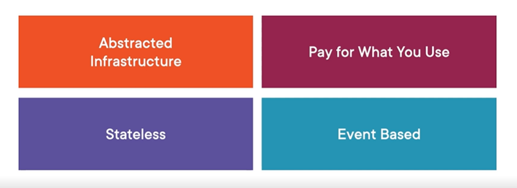
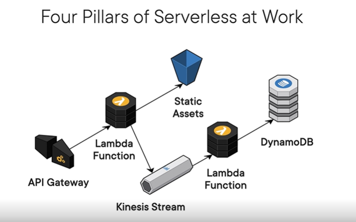
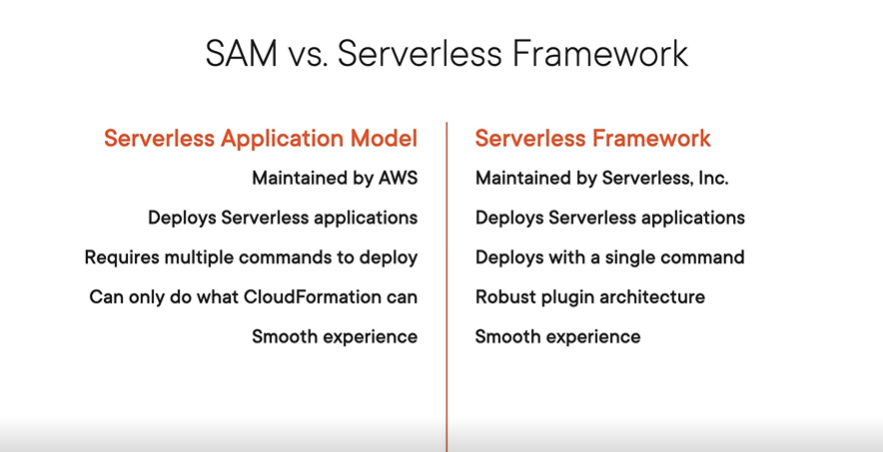
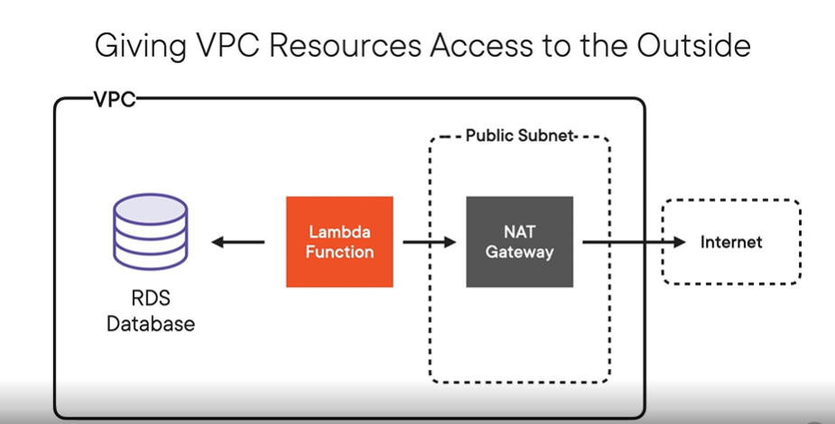
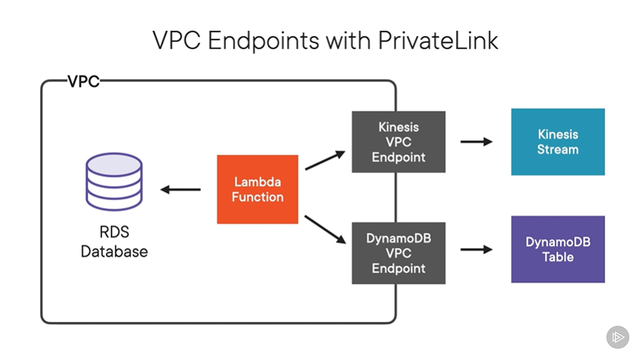
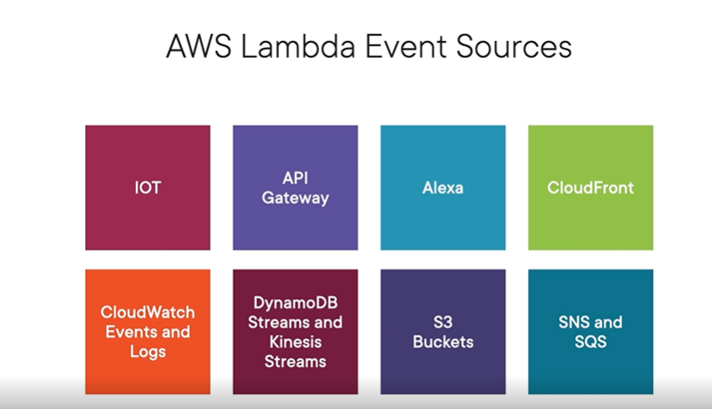
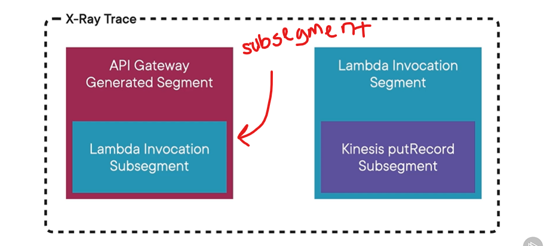

# Serverless Architecture and Monitoring

## Building the Foundations of Serverless Architecture in AWS

Serverless has the following benefits:

1. Don't manage the infastructure
2. Only pay for what you use
3. State is not saved between requests. State must be handled with a database like RDS
4. Lambdas are event based with triggers like CRON, HTTP, or messages

### Architecting a Serverless App

1. Computing: Do you need lambdas or servers?
2. Storage: How many S3 buckets do you need?
3. Persistance: Need RDS/DynamoDB or caching with Elasticache
4. Eventing: Other services like Api Gateway, Kinesis, or SQS

### The Serverless Framework

Let's you configure, test, develop, and deploy from a single configuration file. 

Benefits:
1. Simple and easy deployment
2. Easy to reproduce architecture
3. Local execution for development and debugging

## Going Serverless in AWS with Lambda

### Organizing Lambdas

Option 1: Lambda Monolith - All of your code is in one function
    - This is not ideal
Option 2: Create a lambda for each controller method

### Limits

Direct Upload Package Size: 50MB
Unzipped Package Size: 250MB
There's a limit on the number of concurrently running lambdas per account

### Metrics

AWS provides these Lambda metrics for free
1. Invocation Count
2. Execution Duration
3. Error Count
4. Throttle Count
5. Iterator Age
6. DLQ Errors

### Security

When a Lambda runs, it assums an IAM role
AWS recommends that each Lambda function has its own role that no other function shares! 

Approaches to storing resource credentials for your Lambda (from least -> most secure):
1. Store them in your code - DO NOT DO THIS
2. Store credentials as environment variables
    - These are encrypted at rest
    - This is in the Lambda >> Configuration >> Environment Variables
3. Store in the EC2 Parameter Store
    - Lets you access secrets over the command line
    - Adds some latency to the app but greatly improves security
4. Store in the Secrets Manager
    - Lets you access secrets through SDK
    - Has built-in support for RDS, DynamoDB, Redshift, external DBs
    - Can auto-rotate keys too!

### Stability

1. Monitor errors
2. Ensure that Lambda is processing all events that it receives

**Dead Letter Queue**: SNS Topic or SQS queue where triggering events are sent if the Lambda function errors out.
    - Support for this is built-in with the Lambda but you have to setup configurations to handle items in the DLQ

### Performance and Concurrency

There's a limit to how much memory a function can use. It defaults to 1024 MB
Increasing the memory will increase the amount of work the CPU can do, so if you have longer running functions - increase the memory.

**Provisioned Concurrency** - Reduces cold start latency by always having it running. This can get expensive

### Serverless Application Model (SAM)

At the core of it, SAM is just a configuration file.

Resource Types

- `AWS::Serverless::Function`
    - Creates a lambda function, IAM execution role, and event source mappings
- `AWS::Serverless::API`
    - Creates an API Gateway mapping
    - Creates a Rest API, resources and methods, and Swagger configuration
- `AWS::Serverless::SimpleTable`
    - Creates a DynamoDB with no secondary indexes
    - Use normal DynamoDB type through cloud formation if more config is needed

How to deploy
`sam build && sam deploy`

## Sourcing Servless Events in AWS and API Gateway and Kinesis

### Serverless Architecture and VPC

This picture is showing that the database should be secured in a VPC always but it needs to be accessed by a lambda that can be hit from the internet. So, you can put that Lambda in the VPC too (making it able to talk to RDS) and then create a new public subnet inside your VPC with a NAT Gateway which talks to the internet. This used to be the preferred method until Private Links were introduced in 2017.

**PrivateLink** - VPC endpoint that connects directly to PUBLIC AWS resources without leaving the AWS infrastructure. 

These are configured per service and per region. They also aren't free and are about $8 / month.

This is much more secure and can even be faster!

### Configuring VPC Endpoints for Serverless Apps

VPC Endpoints enable connections between a VPC and a service without going through an internet gateway, NAT device, VPN connection, or Direct Connect connection

They aren't cheap either - about 1 cent / hr => $8 / month
Limit: Per service per region

### Lambda Event Sources in AWS

Analogy: Lambdas as the bones and event sources are the joints
Examples of Event Sources:
    - IoT button press
    - API Gateway for REST request
    - Alexa
    - CloudFront
    - CloudWatch Events and Logs (for when an alarm is triggered)
    - DynamoDB and Kinesis Streams
    - Modifications to an S3 bucket
    - SNS and SQS

### API Gateway Security

When using Lambdas with other AWS event sources, you don't need auth because it's just AWS but with API Gateway, requests could be coming from who knows where.

There are 3 different auth built-in authorizors for API Gateway
    - Cognito
    - Custom Lambda Function
    - IAM

An authorizor is am IAM role that either returns ALLOW or DENY.
Authorizors can be re-used across lambdas

### Push and Pull Event Source Types

Push Events 
- These send events to the Lambda like an API Gateway request
- The Event Source require access to invoke the Lambda
- Examples: IoT, API Gateway, Alexa, CloudFront, CloudWatch Events/Logs, S3, and SNS

Pull Events
- These are poll events that occur every-so-often and trigger an event if new data is there.
- Lambdas require access to invoke the Event Source
- Examples: DynamoDB, Kinesis, SQS
- Polling Frequency
    - DynamoDB: 4 times / second
    - Kinesis:  1 time  / second
    - SQS:      Configurable

## Monitoring Applications in AWS with X-Ray and CloudWatch

### How X-Ray Works

X-Ray monitors requests as they go across your services using the Trace-Id and Trace-Data

It doesn't monitor every request that goes through the system. Instead it does 1 request / second and then 5% of subsequent requests

### Tracing in AWS X-Ray

**X-Ray Trace**: Representation of the actions taken in response to a single request to your application
    - When the first X-Ray enabled service in your app receives a request, it will generate the Trace Id (if it doesn't exist)
**X-Ray Segment**: A single packet of data describing an action that took place in response to a request. (Contains a Trace Id).

### Monitoring Serverless Applications with X-Ray

1. Enabling X-Ray Tracing for Services
    - Similar to enabling App Insights for a service
2. Using the AWS X-Ray SDK
    - You can manually tell X-Ray that you are in a specific "segment" vs "sub-segment"

### Monitoring Serverless Applications with CloudWatch

** CloudWatch Alarms can trigger a Lambda when an alarm is triggered