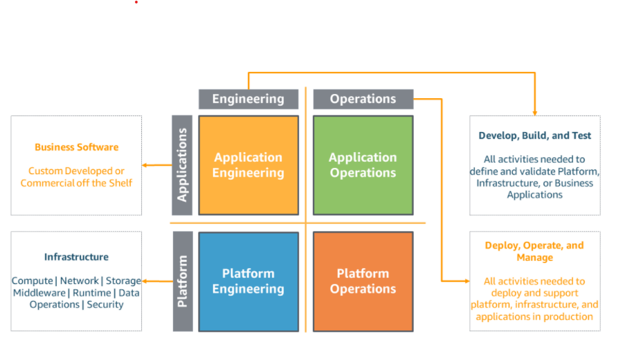
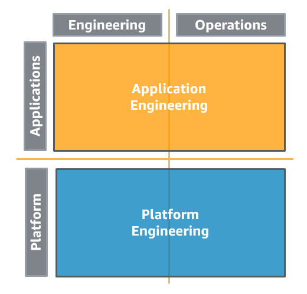
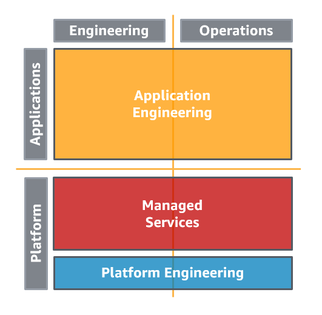
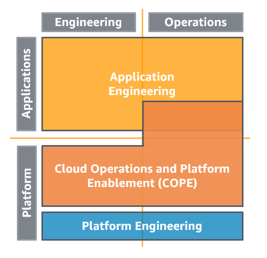
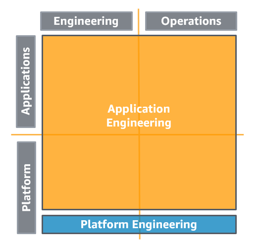
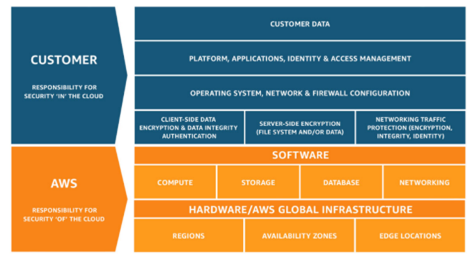

# AWS Well-Architected Framework

## Overview

This framework helps you understand the pros/cons of building systems in AWS.
It covers security, reliability, efficiency, cost-effectiveness, and sustainable workloads.

AWS architects have looked at hundreds of customers' architectures and have identified best practices.

There's a free AWS tool that will review your workloads against the well-architected framework.

The Six Pillars of a Well-Architected Framework:
    1. [Operational Excellence](#operational-excellence)
    2. [Security](#security)
    3. [Reliability](#reliability)
    4. [Performance Efficiency](#performance-efficiency)
    5. [Cost Optimization](#cost-optimization)
    6. [Sustainability](#sustainability)

### Common Definitions

**Component**: The code, configuration, and AWS resources that together deliver against a requirement

**Workload**: A set of components that work together to deliver business value

**Architecture**: How components work together in a workload.

**Milestone**: A mark of a key change in your architecture as it evolves throughout the product lifecycle

**Technology Portfolio**: A collection of workloads that are required for the business to operate

### On Architecture

There are two schools of thought for architecture: either have a centralized team for a corporation that ensures that every team is following cloud best practices or delegate that responsibility to the teams. AWS recommends the latter and has mechanisms in place to ensure standards are being met.

There are "lunch time" talks that help developers focus on applying best practices to real examples. These talks are recorded!

### General Design Principles

1. **Stop guessing your capacity needs**: If you make a bad decision about workload capacity, you could be sitting on expensive idle resources or on the flip-side, dealing with performance bottlenecks

2. **Test systems at production scale**: You can spin-up a production environment, test it at scale, and then decommission it. So, you only paid for what you used.

3. **Automate to make architectural experimentation easier**: Automation can help you create and replicate workloads at low cost and low effort. Plus they're versioned.

4. **Allow for evolutionary architectures**: Initial architecture decisions can hinder how a product progresses; if you automate and test on demand, it lowers the risk of impact from design changes.

5. **Drive architectures using data**: Use logs to inform how design decisions affect performance.

6. **Improve through game days**: Schedule days that simulate production workloads so you can see where improvements can be made.

## Operational Excellence

The operational excellence pillar includes how your organization supports your business objectives, your ability to run workloads effectively, gain insight into their operations, and to continuously improve supporting processes and procedures to deliver business value.

### Design Principles

1. Perform operations as code
    - Use Infrastructure as Code (IaC)
    - Script operational procedures and automate their execution by triggering them in response to events
2. Make frequent, small, reversible changes
    - Make sure they're small so you can identify which change caused an error and reverse it if necessary
3. Refine operation procedures frequently
    - Look for improvement opportunities and do them!
    - Schedule "game days"
4. Anticipate failure
    - Inject chaos to find failure points
5. Learn from all operational failures and share out

### Area #1: Organization
    
#### Models

These are common models that organizations use to enable app development and cloud resource operations. They chronologically range from fully separated to fully decentralized where the latter is the best in AWS' opinion.    

1. Fully Separated
    

2. Separated Application Engineering and Operations (AEO) and Infrastructure Engineering and Operations (IEO) with Centralized Governance
    

3. Separated AEO and IEO with Centralized Governance and a Service Provider
    - This outsources the expertise of implementing cloud environments, security, and compliance requirements so teams can focus on building code without supporting the infrastructure
    
    - Tradeoffs
        1. You gain provider's standards, best practices, processes, and expertise.
        2. Gain benefits on their ongoing development of their service offerings
        3. You don't have to invest the time in learning these yourself
        4. Introduces bottlenecks and delays created by task handoffs between teams and the service provider
        5. Potential rework could happen for teams if the service provider identifies a defect once it got to them

4. Separated AEO and IEO with Centralized Governance and an **Internal** Service Provider Consulting Partner
    - As an organization gets larger, the demand increases on the IEO team. So, they setup an internal consulting team that helps educate application teams to manage their own resources
    - They create the guardrails to enable security and efficiency so that they can gradually reduce their presence
    

5. Separated AEO and IEO with Decentralized Governance
    - This is the desired outcome from AWS because application teams are responsible for the development and operation of their software and cloud resources. They are expected to be incredibly knowledgeable about the cloud but have guardrails in place by the IEO team that prevent them from doing something incredibly stupid.
    - Decentralized is better than centralized because the knowledge is shared and enforced through automation
    - This reduces the bottlenecks created by handing off tickets between AEO and IEO
    - IEO uses AWS Control Tower to implement governance
    

### Area #2: Prepare

#### Design Telemetry

Enable telemetry for your services and applications in the form of logs, events, state changes, privilege access, utilization limits, etc.

You can't respond unless you know something happened and you were alerted. Good resources are CloudWatch for services/apps and CloudTrail for compliance.

#### Design for Operations

1. Use Version Control with CloudFormation and CodeCommit
2. Automate Testing and Validate Configuration Changes
3. Setup CI/CD pipelines
4. Keep your resources secure by applying software patches
5. Share Design Standards
6. Improve Code Quality with CodeGuru (identifies potential code and security issues)
7. Use Multiple Environments
8. Make frequent, small, reversible changes

### Area #3: Operate

#### Understanding Workload Health

1. Identify KPIs like customer retention, profit, order rate
2. Define workload metrics that help measure the achievement of KPIs (like abandoned shopping carts, orders placed, cost, price, etc.) and the health of the workload (like error rate, requests / second, utilization, etc.)
3. Analyze workload metrics
4. Establish workload metric baselines
5. Identify workload metric anomalies
6. Get alerted when workloads are at risk

#### Responding to Events

**Runbook**: Documented procedures to well understood events to achieve a specific outcome.

    - Example: A procedure to update static website content, staging in an uploaded content location, updating the website to reference the new content, and validating that it displays the new content

**Playbook**: Documented investigation and response processes to failure scenarios. They are defined steps to perform to identify an issue.

    - Example: A series of steps to figure out why an app has network connectivity issues where step 1 is check the DNS, step 2 is to check if the client can reach the host, etc.

1. Have a process for every alert. The alert is documented and well-defined plus it has an owner
2. Prioritize events based on how they impact the business
3. Define when an alert should be escalated
4. Enable push notifications
5. Communicate status through dashboards
6. Automate responses to events

### Area #4: Evolve

#### Learn, Share, and Improve

1. Have a process for continuous improvement
2. Perform post-mortem analysis
3. Share Lessons Learned
4. Make Time for Improvements

## Security

### Design Principles

1. Implement a strong identity foundation
    - Principle of Least Privilege
    - Enforce separation of duties with appropriate authorization for each action with AWS resources
    - Centralize identity management with IAM
2. Enable Traceability with CloudTrail
3. Apply Security at All Layers (CloudFront -> VPC -> Load Balancer -> ACL -> Security Group -> Resource)
4. Automate Security Best Practices
5. Protect Data in Transit and at Rest with Encryption, Access Tokens, and Access Control
6. Keep People Away From Data (getting in the database because this leads to modification and human error)
7. Prepare for Security Events

### Area #1: Foundations

#### Shared Responsibility

_Security of the Cloud_ vs _Security in the Cloud_ means that AWS is responsible for protecting the infrastructure that runs all the services in the cloud whereas the customer is responsible for securing those resources

#### AWS Response to Abuse and Compromise

If something malicious happens, AWS will contact the root user and any other secondary contacts you have configured. If you only have a single contact, that means you have a single point of failure :<.

The AWS abuse response team monitors and shuts down unauthorized activity which include:

1. Compromised Resources - such as an infected EC2 instance because a patch wasn't implemented
2. Unintentional Abuse - meaning your app was interpreted as abusive to other websites like a bot-crawler
3. Secondary Abuse - where an end user uploaded malware to a public S3 bucket
4. False Complaints - internet users mistakenly report legitimate activity as abuse

#### Account Management and Separation

Important: AWS recommends placing workloads in separate accounts and then group accounts based on function, compliance, or a common set of controls. That's because accounts are a hard boundary. For example, put production workloads in different accounts than development and test workloads.

Secure your AWS account by not using the root user, use MFA, keep contact info up to date.

Using AWS Organizations, you can set global control policies, specific regions to use, central logging, etc.

### Identity and Access Management (IAM)

### Area #2: Identity and Access Management

### Area #3: Detection

### Area #4: Infrastructure Protection

### Area #5: Data Protection

### Area #6: Incident Response

## Reliability

## Performance Efficiency

## Cost Optimization

## Sustainability